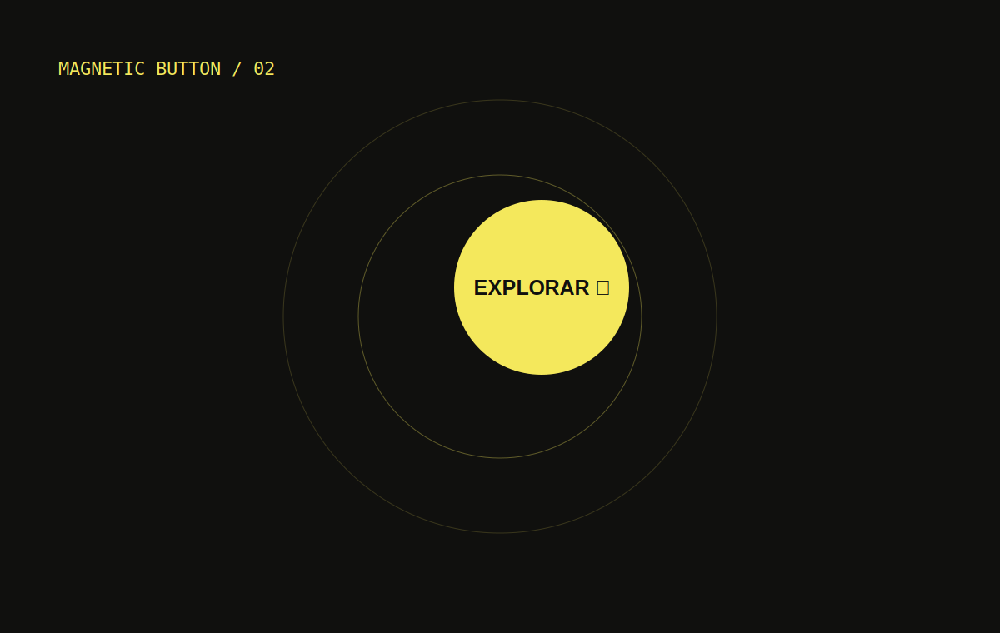

# Magnetic Button Effect

A magnetic button that responds to cursor proximity and provides an equivalent touch reaction.

## Features

- Adjustable force and smoothing.
- Progressive return to rest with `requestAnimationFrame`.
- Touch alternative and reduced-motion support.
- Responsive, dependency-free, and Netlify-ready.
- Complete effect and controls inside a single capture.

## Live demo

[magneticfx.ntdesweb.dev](https://magneticfx.ntdesweb.dev/)

## Installation

Clone the repository, enter `magnetic-button-effect`, and open `index.html`.

## Project structure

`index.html` contains semantics, `style.css` the visual system, `capture.css` the one-shot composition, `script.js` the physics, and `assets/` the SVG images.

## Customization

Adjust `--accent`, the `.magnet` size, and the force and smoothing control limits.

## Accessibility

The control is a native button, inputs are labelled, touch receives equivalent feedback, and `prefers-reduced-motion` disables displacement.

## Performance

Only `transform` is animated, updates are grouped with `requestAnimationFrame`, and no nodes are created while interacting.

## License and credits

[MIT](LICENSE). Created by [Nacho Torres](https://github.com/NachoTorresRD) for [NTDESWEB](https://www.ntdesweb.com) with [NT-SKILL SUPREME](https://github.com/NachoTorresRD/nt-skill-supreme).

[View on GitHub](https://github.com/NachoTorresRD/magnetic-button-effect) · [Work with NTDESWEB](https://www.ntdesweb.com)
